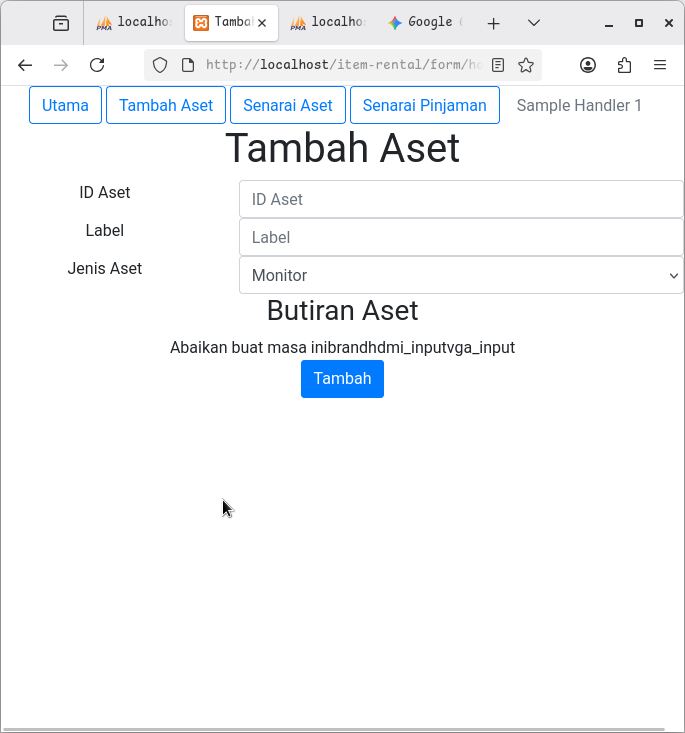
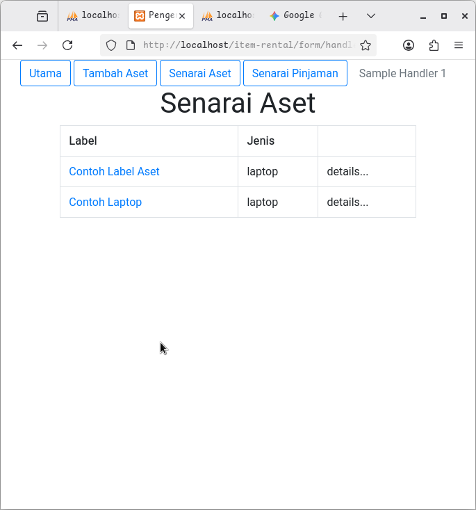
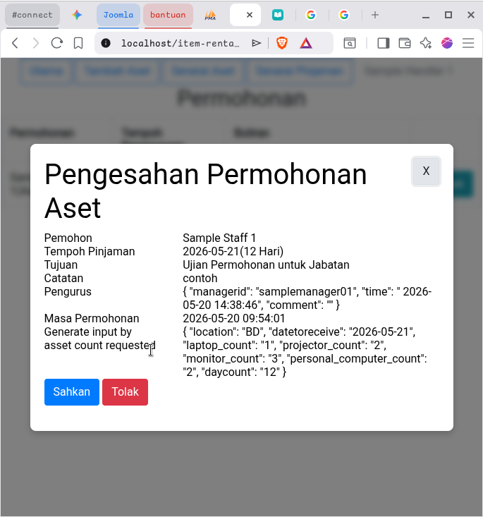
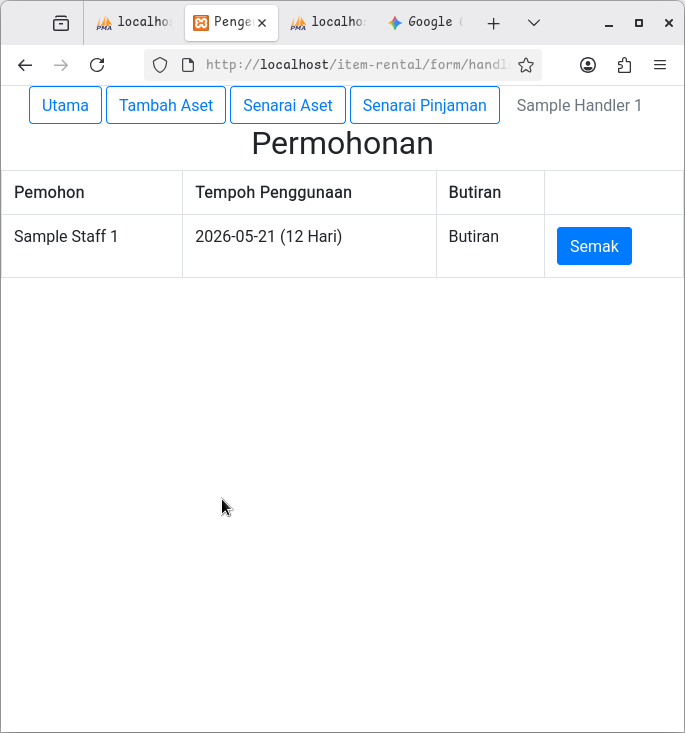
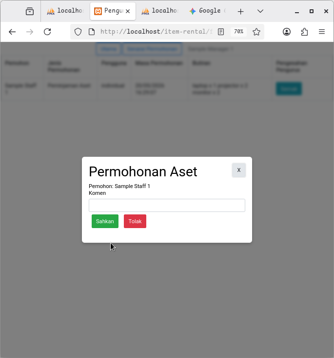
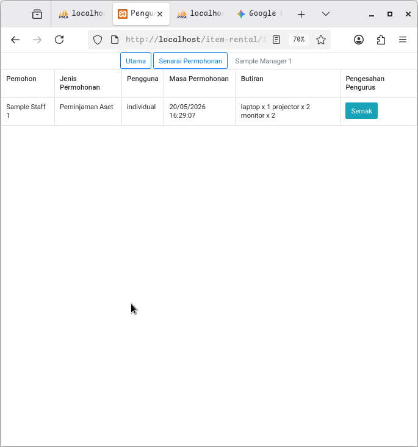
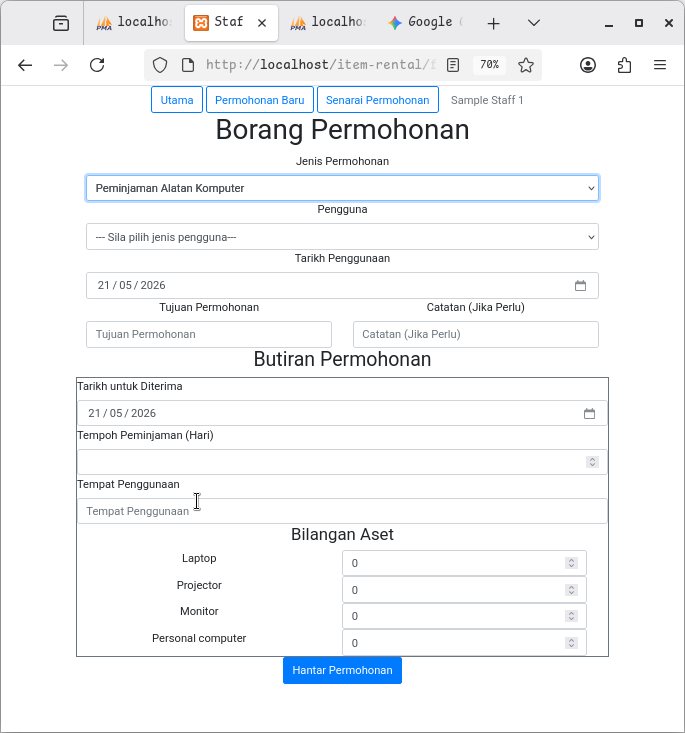
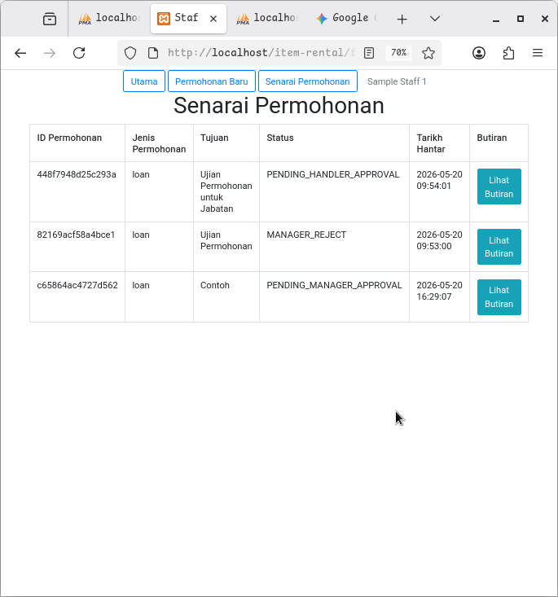
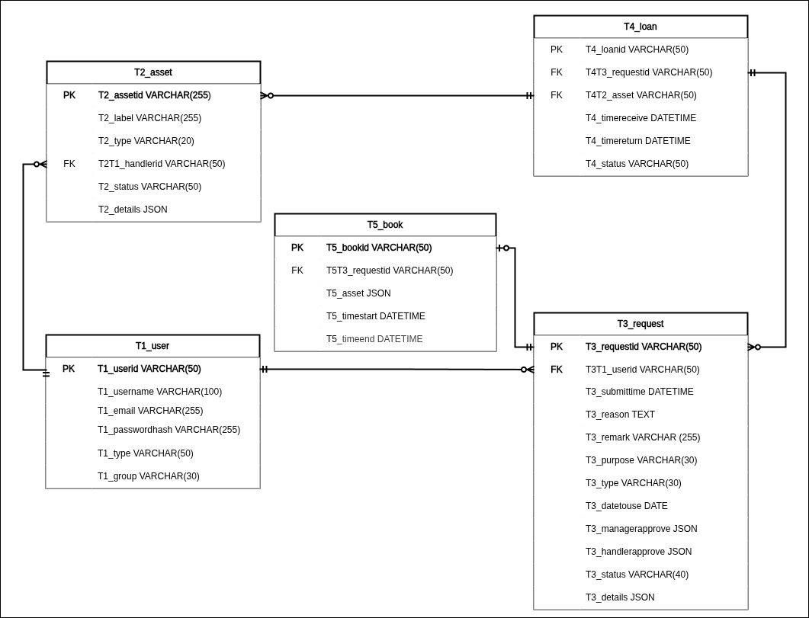

# Peminjaman Alatan Komputer Bahagian Digital PKINK
**Clone the Project**
Run these commands in your terminal to download the files and enter the correct folder:
```
git clone https://github.com/darwishzain/pinjaman-aset
cd pinjaman-aset/laravel
```
**Setup the Encironment**
Create your local configuration file by copying the example template:
`cp .env.example .env`
Note: Open your new .env file and update the DB_DATABASE, DB_USERNAME, and DB_PASSWORD lines to match your local setup.

**Initialize**
Create an empty MySQL database matching your .env name, then run
```
composer install
php artisan key:generate
npm install && npm run dev
```
**Seeding Roles and Permissions**
`php artisan db:seed --class=RolesAndPermissionsSeeder`

TODO: update seeder for add sample data only
# Modules
- **Home** `php/index.php`
  - [ ] View Laptop Status Overview `superadmin, admin`
  - [ ] View Loan Status Overview `superadmin, admin`
  - [ ] View Own Loan Status Overview `staff`
- **User** `php/user.php`
  - [ ] View Users List `superadmin,admin`
  - [ ] Add User (username,password,role) `superadmin`
  - [ ] Change User Role (role)`superadmin`
  - [ ] Reset Password (password)`superadmin,admin`
  - [ ] Update Own Password (password) `*`
  - [ ] View Profile(*) `superadmin,admin`
  - [ ] View/Manage Own Profile (*) `*`
- **Assett** `php/asset.php` !!
  - [ ] View Asset Overview (status,details(condition))`superadmin, admin`
  - [ ] View List of Asset `superadmin,admin``
  - [ ] Add Asset (label,type,status,details{CONNECTOR_,condition}) `superadmin`
  - [ ] Update Asset (status details{*}) `superadmin,admin`
- **Request** `php/request.php` !!
  - [ ] View Request Overview `superadmin,admin`
  - [ ] View Request List `superadmin,admin`
  - [ ] View Own Request List `staff`
  - [ ] View Request `staff`
  - [ ] Add Request `staff`
- **Pinjaman** `php` !!
### Database
- [Structure ](form/s21052026.sql) (`.sql`)
- [Sample User](form/T1_user_21052026.sql) (`.sql`)
## TODO
- [x] login(important - hardcoded the password - delete later) - maybe on `index.php`
- [ ] validate date not on weekends and datetouse > datetoreceive/datestart,dateend(dateend>datestart)
- [ ] fix UI
- [ ] better request id generation(?)
- [ ] documentation on T*_details syntax
- [ ] asset.details dynamic to datatype(str,int etc)

## Activity and Role Access
`SA: Superadmin A:Admin M:Manager S:Staff`
| Activity | SA | A | M | S | Route |
| :---| --- | ---| ---| --- | ---|
| Review Request | :x: | :x: | :x: | | `/request/review/:requestid` |
| Save Request | | | | :x: |  |
| Submit Request | | | | :x: | `/request/add` |
| View Request | :x: | :x: | :x: | :x: | `/request/view/:requestid` |
| View Request List | :x: | :x: | :x: | :x: | `/request/list` |
| Add Asset | :x: | :x: | | | `/asset/add` |
| View Asset | :x: |:x: | | | `/asset/view/:assetid` |
| View Asset List | :x: |:x: | | | `/asset/list` |
| Update Asset | :x: |:x: | | | `/asset/update/:assetid` |
| Add User | :x: | :x: | | | `/user/add` |
| Change Role | :x: | :x: | | | `/user/list/` |
| View User List | :x: | :x: | :x: | | `/user/list` |
| View Profile | :x: | :x: | :x: | :x: | `/profile/:userid` |
| Update Profile | :x: | :x: | :x: | :x: | `/profile` |
| Process Asset Transaction | :x: | :x: | | | `/transaction/out`,`transaction/in` |
| View Transaction | :x: | :x: | :x: | :x: | `transaction/:transactionid` |
| View Transaction List | :x: | :x: | :x: | :x: | `/transaction/list` |


## Feature suggestions
- Close request option if no asset available
- Warning if device availablity is low
## Halaman (Status)
- Pengguna (Peminjam) `staff`
  - [x] peminjaman(baru)`/?request`
  - [ ] peminjaman(perihal)`/?request=REQUESTID` - only check status??
  - [ ] peminjaman(rekod)`/?list`
- Pengurus `manager`
  - [ ] peminjaman(pengesahan) `?request=REQUESTID`
  - [ ] peminjaman(rekod) `?request`
  - [x] peminjaman(--pending approval) `?`
- Pengendali `handler`
  - [x] aset(tambah)`/?asset&new`
  - [x] aset(kemaskini)`/?asset=ASSETID`
  - [x] aset(senarai)`/?asset`
  - [ ] peminjaman(senarai)`/?status=STATUS`
  - [x] peminjaman(record)`/?request`
  - [ ] peminjaman(pengesahan+tetapkan aset)`/?request=REQUESTID`

## Contoh Halaman








## Entity Relation Diagram (ERD)

### Justification

**T1-T3/T3-T1**
- user may not make a request
- user can make multiple request
- one request can only belong to one user
---
**T1-T2/T2-T1**
- user may not handle an asset
- user can hanfle many assets
- one asset can only be handled by one user
---
**T3-T4/T4-T3**
- one loan can only belong to one request
- one request may not have loan
- one request can have multiple loan
---
**T3-T5/T5-T3** 
`KIV for now.`
- one book can only belong to one request
- one request may not have book
- one request can only have one book
---
**T2-T4/T4-T2**
- loan need to have at least one asset
- loan can only have one asset
- asset may not have a loan at all
- asset can be in multiple loan

