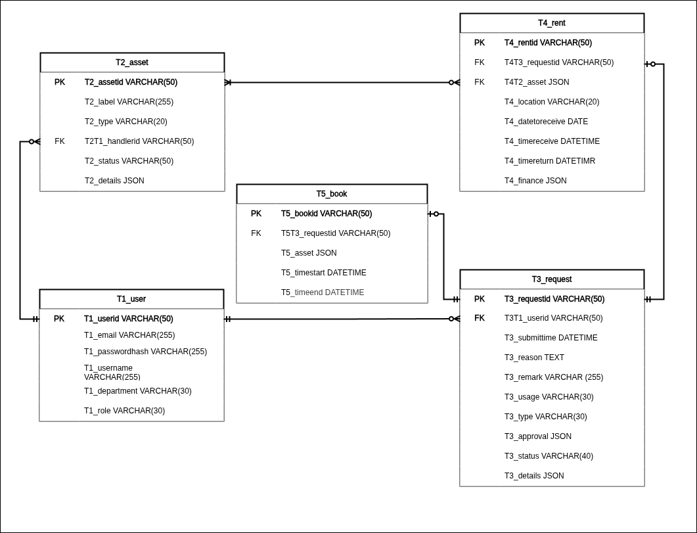

# Peminjaman Alatan Komputer Bahagian Digital PKINK

## TODO
- [ ] handler asset management
- [ ] better request id generation(?)

## Feature suggestions
- Close request if no asset available
## Halaman (Status)
- Pengguna (Peminjam) `staff`
  - [x] peminjaman(baru)`/?request`
  - [ ] peminjaman(perihal)`/?request=REQUESTID` - only check status??
  - [ ] peminjaman(rekod)`/?list`
- Pengurus `manager`
  - [ ] peminjaman(rekod)
  - [ ] peminjaman(pengesahan)
- Pengendali `handler`
  - [x] aset(tambah)`/?asset&new`
  - [x] aset(kemaskini)`/?asset=ASSETID`
  - [x] aset(senarai)`/?asset`
  - [ ] peminjaman(senarai)`/?status=STATUS`
  - [ ] peminjaman(record)`/?request`
  - [ ] peminjaman(pengesahan+tetapkan aset)`/?request=REQUESTID`

## Entity Relation Diagram (ERD)

### Justification

**T1-T3/T3-T1**
- user may not make a request
- user can make multiple request
- one request can only belong to one user
---
**T1-T2/T2-T1**
- user may not handle an asset
- user can hanfle many assets
- one asset can only be handled by one user
---
**T3-T4/T4-T3**
- one loan can only belong to one request
- one request may not have loan
- one request can have multiple loan
---
**T3-T5/T5-T3** 
`KIV for now.`
- one book can only belong to one request
- one request may not have book
- one request can only have one book
---
**T2-T4/T4-T2**
- loan need to have at least one asset
- loan can only have one asset
- asset may not have a loan at all
- asset can be in multiple loan

